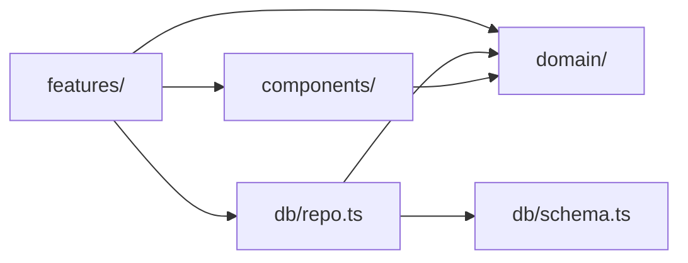

# Architecture

ReorgLife is a single Expo app with no backend. Everything it knows lives in
one encrypted SQLite file on the device.

## Map

```
App.tsx                 tab shell, decides onboarding vs main
index.ts                Expo entry point

src/
  domain/               pure logic — no React, no Expo, no react-native
    xp.ts               XP awards, levelFor, xpForLevel
    streaks.ts          schedules, isDueOn, gentle streak rules
    unlockables.ts      level-gated accessories
    characters.ts       the companions and the mood scale
    domains.ts          life areas
    time.ts             local-time day keys
    companion.ts        time-of-day rotation and cross-fade — see ADR 0001

  db/
    schema.ts           one schema for all platforms + user_version migrations
    index.ts            native: SQLCipher, key from the OS keystore
    index.web.ts        web preview: same schema, unencrypted
    repo.ts             every query; one implementation for both platforms

  features/             screens, one folder per feature
    checkin/ habits/ timeline/ home/ onboarding/ settings/
    rewards/ integrations/          (placeholders with READMEs)

  components/           shared presentational components
  backup.ts             encrypt/decrypt a backup bundle
  backupFile.ts(.web)   write and read the backup file
  kv.ts(.web)           keystore on native, localStorage on web
  reminders.ts          local notifications; no-op on web
  characterArt.ts       character + mood -> artwork, or nothing
  theme.ts              light and dark colours

tests/
  unit/domain/          plain Node
  unit/db/              real in-memory SQLite (node:sqlite)
  component/            React Native Testing Library
  e2e/                  Playwright against the web build
  helpers/              test database and an expo-crypto double
```

## The dependency rule



Arrows only point this way. `domain/` imports nothing from the app, which is
why it can be tested in plain Node, and ESLint enforces it. Features never
import each other; anything two features need belongs in `domain/` or
`components/`.

## Platform splits

Metro picks `X.web.ts` over `X.ts` when bundling for web. That is the only
mechanism used, and it is used in exactly three places:

| Concern       | Native                              | Web preview                            |
| ------------- | ----------------------------------- | -------------------------------------- |
| Database      | SQLCipher, key from the OS keystore | wa-sqlite in a worker, **unencrypted** |
| Secrets       | `expo-secure-store`                 | `localStorage`                         |
| Backup file   | `expo-file-system` + share sheet    | object URL download                    |
| Notifications | `expo-notifications`                | no-op                                  |

The web build is a **development preview only** and says so in a permanent
banner. It exists so screens can be checked on a laptop, and so the critical
flow can be smoke-tested in CI without an emulator. Nothing about it is allowed
to weaken the native path.

## Data

One SQLite database, `reorglife.db`.

| Table        | Holds                                                            |
| ------------ | ---------------------------------------------------------------- |
| `profile`    | Single row: companion, display name, XP                          |
| `checkins`   | One row per day: mood 1–5 and a note                             |
| `events`     | Timeline entries, by life area, done or not                      |
| `habits`     | Recurring items: schedule, optional reminder time, archived flag |
| `habit_logs` | One row per habit per day it was ticked                          |
| `settings`   | Small key/value preferences                                      |

Migrations are numbered in `schema.ts` and tracked with `PRAGMA user_version`.
They run on every launch, in order, and must be idempotent. A shipped
migration is never edited — add another one.

## Encryption

- The database key is 32 random bytes, generated on first launch, held in the
  OS keystore via `expo-secure-store`. It never leaves the device.
- Backups are AES-256-GCM over the whole dataset. The key is generated fresh
  for each export and shown **once** as a recovery key. It is not stored, not
  written into the file, and cannot be recovered.
- There is deliberately no passphrase. `expo-crypto` offers no PBKDF2, and a
  hand-rolled key derivation would have been weaker than a random 256-bit key.
  The trade is explicit: lose the recovery key and the backup is gone.

## What this app never does

No backend. No analytics. No crash reporting. No AI API. No network call that
carries personal data. See [PRIVACY.md](PRIVACY.md).
